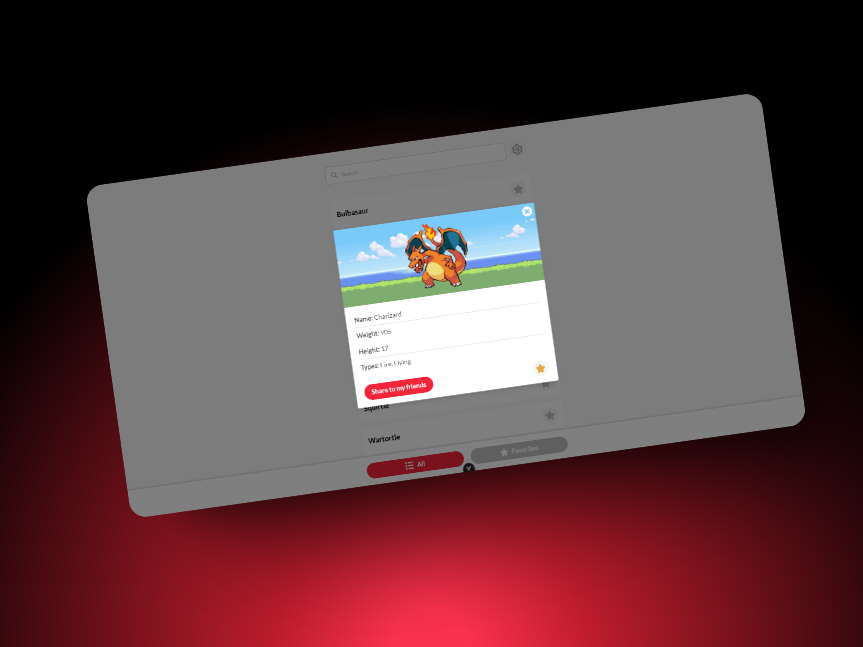

# Pokedex Global66

Una aplicación de Vue 3 desarrollada con Vite, que sirve como Pokédex global para explorar y ver detalles de Pokémons. Este proyecto demuestra varias funcionalidades modernas en una SPA (Single Page Application).

[Sitio web](https://pokedex-global66.fabergrajales.com)

## Preview



## Descripción del Proyecto

La aplicación permite visualizar una lista de Pokémons, navegar hacia una vista detallada de cada uno y ofrece una experiencia de usuario fluida.

## Estructura de Carpetas

La estructura del proyecto está organizada de la siguiente manera:

```
└── src/
   ├── assets/
   │   ├── utils/
   │   │   └── localstorage.utility.ts
   │   ├── animations.css
   │   └── main.css
   │  
   ├── components/
   │   ├── icons/
   │   │   └── (...).vue
   │   ├── menu/
   │   │   └── (...).vue
   │   ├── pokemon/
   │   │   └── (...).vue
   │   └── ui/
   │       ├── icons/
   │       │   └── (...).vue
   │       └── (...).vue
   │  
   ├── layouts/
   │   └── MainLayout.vue
   │  
   ├── router/
   │   └── index.ts
   │  
   ├── services/
   │   ├── adapter/
   │   │   ├── external-pokemon.interfaces.ts
   │   │   └── pokemonAdapter.ts
   │   └── pokemonService.ts
   │  
   ├── stores/
   │   └── pokemonStore.ts
   │
   ├── views/
   │   ├── PokemonDetailView.vue
   │   ├── PokemonListView.vue
   │   └── WelcomeView.vue
   │
   ├── App.vue
   └── main.ts

```

## Funcionalidades Clave

- **InfinityScroll**:  
  Permite cargar más contenido a medida que el usuario se desplaza hacia abajo. implementando el hook `useInfinityScroll`.

- **VirtualList**:
  Esta funcionalidad optimiza el rendimiento al renderizar únicamente los elementos que son visibles en pantalla. Ideal para listas extensas, reduce la carga del DOM y mejora la velocidad de renderizado, ofreciendo una experiencia más fluida al usuario.

- **Persistencia de Data Configurable**:  
  Se utiliza un store (por ejemplo, `pokemonsStore`) para mantener el estado de la lista de Pokémons, lo que permite conservar los datos a lo largo de la sesión y evitar recargas innecesarias, adicionalmente el usuario puede habilitar la persistencia en localstorage si así lo desea

- **LazyLoad**:  
  El componente `LazyImg.vue` carga las imágenes de forma diferida, mejorando el rendimiento al renderizar solo lo que es visible en pantalla y utilizando un fallback mientras se carga la imagen definitiva.

- **View Transitions**:  
  Las transiciones entre vistas, por ejemplo al abrir la vista de detalle (`PokemonDetailView.vue`), están diseñadas para ofrecer cambios visuales suaves y agradables para el usuario.

- **Animations**:  
  Se aplican animaciones en diversos componentes y transiciones para mejorar la experiencia de usuario, haciendo que la interfaz sea más dinámica e interactiva.

- **Peticiones Cacheadas**
  Al traer el detalle de los pokemones se realizan peticiones fetch preguntando primero por caché para no realizar overposting hacia el servidor

- **Uso de variables de entorno**
  Se utilizan variables de entorno para definir la URL de la API de Pokémons y la URL de donde se cargan las imágenes

- **Filtrado de Pokémons**
  Se permite filtrar los Pokémons por nombre y tipo, facilitando la búsqueda de Pokémons específicos.

## Tecnologías Utilizadas

- **Vue 3**: Framework de JavaScript para la construcción de interfaces de usuario interactivas y reactivas.

- **Vite**: Herramienta de desarrollo rápida y moderna que permite la creación de aplicaciones web con Vue y React.

- **TypeScript**: Lenguaje de programación que añade tipado estático a JavaScript, facilitando la detección de errores y el desarrollo de aplicaciones más seguras y ficientes.

- **TailwindCSS**: Framework de CSS que permite crear estilos y diseños de forma rápida y sencilla, mediante el uso de clases predefinidas.

- **PokeAPI**: API de Pokémon que proporciona información sobre los Pokémons, incluyendo sus nombres, tipos, habilidades y más.

- **@vueuse/core**: Colección de hooks y composables para funcionalidades en general

## Instalación y Uso

### Requisitos

- Node.js y pnpm (o npm/yarn) instalados en tu máquina.

### Clonar el Repositorio

```sh
git clone
```

### Requisitos

- Node.js y pnpm (o npm/yarn) instalados en tu máquina.

### Instalación de las dependencias

```sh
pnpm install
```

### Iniciar el Servidor de Desarrollo

Para iniciar el servidor de desarrollo:

```sh
pnpm dev
```

El servidor se iniciará en [http://localhost:5173](http://localhost:5173).

### Compilar para Producción

Para compilar la aplicación para producción:

```sh
pnpm build
```

Se generará una carpeta `dist` que contiene los archivos optimizados para producción.

## Licencia

Este proyecto está disponible bajo la licencia MIT. Consulta el archivo [LICENSE](./LICENSE) para obtener más información.

## Contacto

- **Autor**: [Faber Grajales](https://github.com/faber1999)
